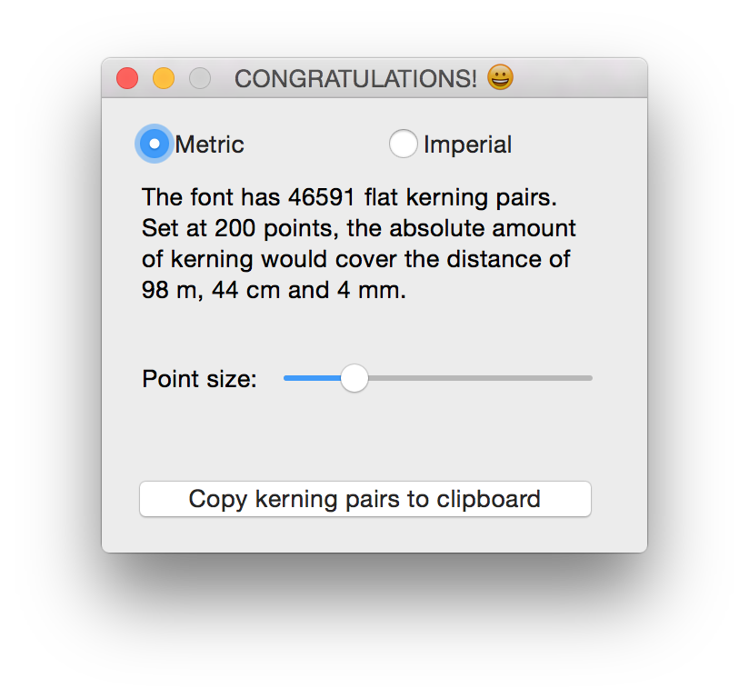

# kernDump 
Various scripts for analyzing, reading and writing kerning information. These 
can be helpful for analyzing kerning (and the loss thereof) through various 
stages of font production.  
Some of these tools have been presented at [ATypI Amsterdam 2013](http://www.atypi.org/past-conferences/atypi-amsterdam-2013/amsterdam-programme/activity?a=265). 

---

### `convertKernedOTFtoKernedUFO.py`
Extracts kerning and groups from a compiled OTF and injects them into a new UFO file (which is created via `tx`).  

__Dependencies:__ `getKerningPairsFromOTF.py` (same repo), [fontTools](https://github.com/behdad/fonttools), `tx` (Part of the Adobe FDK)  
__Environment:__ command line  
```
python convertKernedOTFtoKernedUFO.py font.otf
```

---

### `dumpKerning.py`
Just van Rossum wrote this script. It imports all of the `getKerningPairsFromXXX` scripts (except VFB), and therefore can dump kerning from all kinds of formats (except VFB). Results in a `.kerndump` file at the location of the input file.  

__Dependencies:__ `getKerningPairsFromFEA.py`, `getKerningPairsFromOTF.py`, `getKerningPairsFromUFO.py` (same repo)  
__Environment:__ command line  
```
python dumpKerning.py font.otf
python dumpKerning.py font.ufo
python dumpKerning.py kern.fea
```

---

### `getKerningPairsFromFEA.py`
Extract a list of all kerning pairs that would be created from a feature file.  
Has the ability to use a GlyphOrderAndAliasDB file for translation of 
“friendly” glyph names to final glyph names (for comparison with the output of 
`getKerningPairsFromOTF.py`)  

__Dependencies:__ None  
__Environment:__ command line  

```
python getKerningPairsFromFEA.py kern.fea
python getKerningPairsFromFEA.py -go <path to GlyphOrderAndAliasDB file> kern.fea

```

---

### `getKerningPairsFromOTF.py`
Extract a list of all (flat) GPOS kerning pairs in a font, and report the 
absolute number of pairs.  

__Dependencies:__ [fontTools](https://github.com/behdad/fonttools)  
__Environment:__ command line

```
python getKerningPairsFromOTF.py font.otf
python getKerningPairsFromOTF.py font.ttf
```

---

### `getKerningPairsFromUFO.py`
Extract a list of all (flat) kerning pairs in a UFO file’s kern object, and 
report the absolute number of pairs.  

__Dependencies:__ [defcon](https://github.com/typesupply/defcon) or Robofont  
__Environment:__ command line or Robofont

```
python getKerningPairsFromUFO.py font.ufo
```

---

### `getKerningPairsFromVFB.py`
Extract a list of all (flat) kerning pairs from a VFB’s kern object, and 
report the absolute number of pairs. Run as a FontLab script.  

__Dependencies:__ [FontLab 5](http://old.fontlab.com/font-editor/fontlab-studio/)  
__Environment:__ FontLab

---

### `kernInfoWindow.py`
(Silly) visualization of absolute kerning distance.  
Example of using the above `getKerningPairsFromUFO.py` from within Robofont.  

__Dependencies:__ `getKerningPairsFromUFO.py` (above)  
__Environment:__ Robofont


