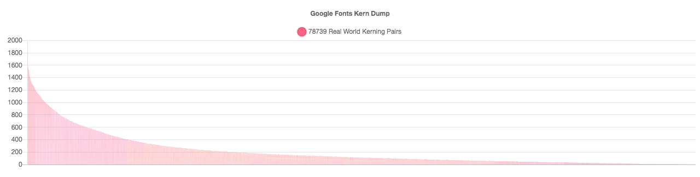
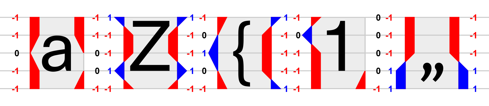
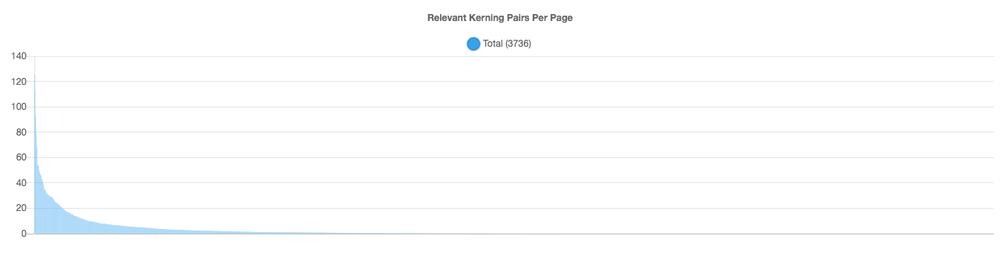
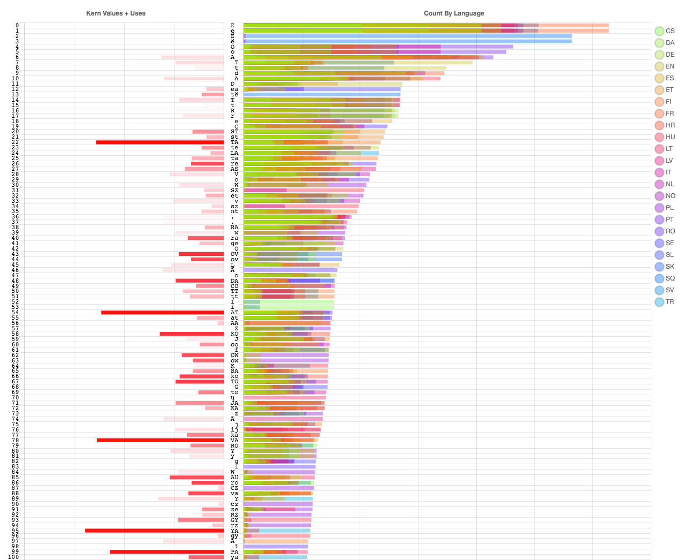
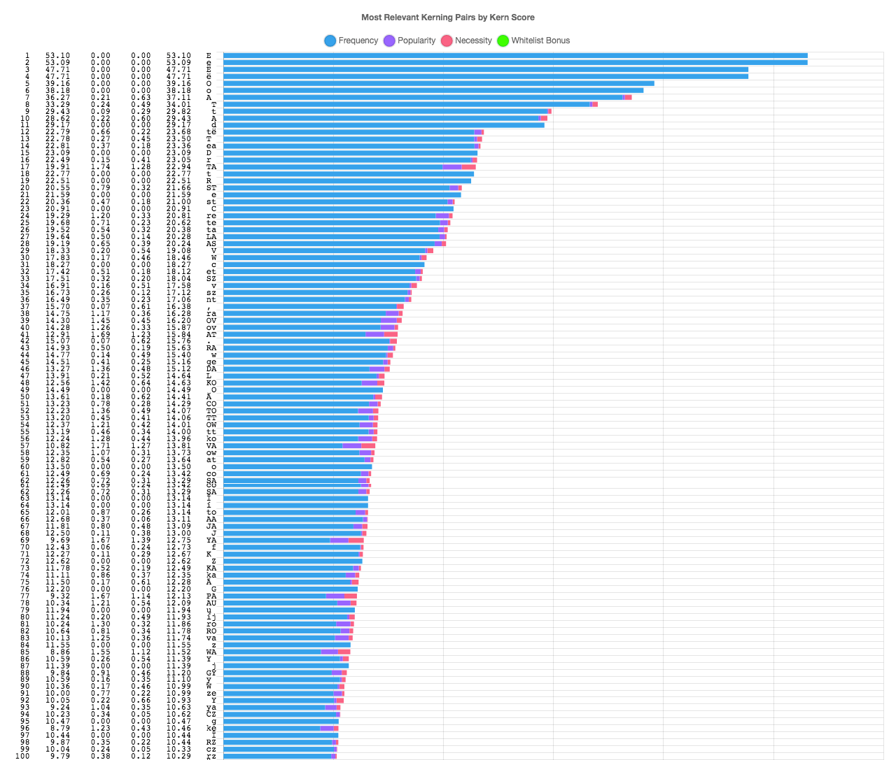
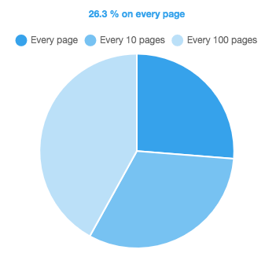
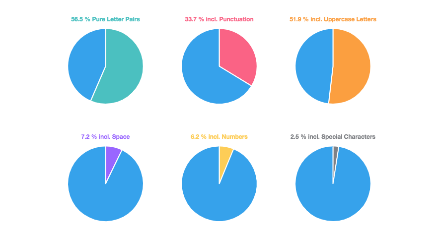

# The Ultimate List of Kerning Pairs

#### Table Of Content
* [Result: Know when to stop](#know-when-to-stop)
* [(1) Popular kerning pairs](#1-popular-kerning-pairs)
* [(2) Potential kerning pairs](#2-potential-kerning-pairs)
* [(3) Frequently occurring kerning pairs](#3-frequently-occurring-kerning-pairs)
* [(4) Relevant kerning pairs](#4-relevant-kerning-pairs)
* [Personal Whitelisting](#personal-whitelisting)
* [Notes](#notes)

## Know when to stop
Find a list of kerning pairs below, ordered by relevance. The relevance score is determined by frequency of occurrence in texts, popularity among type designers and the necessary kerning value. This repository is intended for type designers looking for sample texts for the most complete [kerning](https://en.wikipedia.org/wiki/Kerning) necessary. This list will help you assess which kerning pairs you should look at and where to stop. It takes into account the [Unicode blocks](https://en.wikipedia.org/wiki/Latin_script_in_Unicode) from *Basic Latin* to *Latin Extended A* (plus all kinds of quotes), 24 languages so far and various typeface styles.

👉 [count/total/relevant_kerning.txt](count/total/relevant_kerning.txt) 
👉 [count/total/relevant_kerning_pairs.json](count/total/relevant_kerning_pairs.json) 

The first 1000 to 2000 pairs should have you covered sufficiently in all languages, see (4) for details. Depending on your typeface’s style you don't have to kern each and everyone of them, of course. 

In case you want to reproduce parts of this work: All scripts are self-explanatory and numbered according to the following article. Some parts may also be useful for other works, e.g. the large sample size of texts in many languages. 

## (1) Popular kerning pairs
Let’s start by looking at kern tables of existing fonts to collect more or less common kerning pairs statistically. As a sample I was content with the about 2700 font files of the [Google Fonts Archive](https://github.com/google/fonts). But you can apply this script to any font collection you might want to look at yourself. It uses parts of the [Adobe Type Tools](https://github.com/adobe-type-tools/kern-dump), see directory "kernDump". **72377** unique kerning pairs were used in these fonts. This means, for the set of 300 characters considered, dazzling **80 %** of the possible 90000 combinations are (more or less) used. 

This use count contains a lot of noise caused by subjective decisions and/or group based kerning. It helped a lot to cut off the long tail at some place. In the end, I removed all values lower than 20 percent of the maximum value. Which sounds a lot, but it leaves us with **11899** remaining popular kerning pairs. In Script 3G you can decide for yourself where you would like to make this cut, if desired. Find the uncut list [here.](count/fonts/googleFontsKernDumpList.json)
 
Screenshot. See [charts/01-kern-dump.html](charts/01-kern-dump.html)

## (2) Potential kerning pairs
Another approach to determine possible kerning pairs is combinatorial. The form of each letter can be described by simple numerical values. The values on the adjacent sides or two neighboring letters can be summed up to determine whether this is a possible kerning pair. Like everything that is considered here, this also depends on the design of the font. For a grotesque sans serif typeface—as a proof of concept—a resolution of 3 by 5 units was sufficient for each side (-1, 0 or 1 for ascender, x-height, half-x-height, baseline, descender). More complex serif typefaces might need a higher resolution. 20554 kerning pairs could be generated this way. Compared to the **11899** most "popular" kerning pairs, **11924** other possible ones could be added to the list. I found this approach to generate way less noise than the popular vote before.
 
Excerpt. Find full set here: [shapes/00-letter-shapes.html](shapes/00-letter-shapes.html)

## (3) Frequently occurring kerning pairs
To bring down the runaway number of **23823** pairs to something more manageable let's count how frequent they occur in real-world texts. All texts used as samples were fetched from Wikipedia, mostly within their "Featured Article" category to assure a certain level of quality. In total, the letter pairs of about a 1 GB of text (respectively 2683 [books](Link-to-books-explanation-anchor)) in 24 languages were counted so far. 
<!-- To Do: Separate Script 2C to merge both list -->

| Language   | Code | Total Count* | … in books | Letter Pairs* | Common Kerning Pairs | … in % |     
| ---------- |:----:| ------------:| ----------:| -------------:| --------------------:| ------:|
| Czech      | CS   |     44338357 |     ≈  148 |         12288 |                 4379 | ≈ 36 % |
| Danish     | DA   |     22486111 |     ≈   75 |          8753 |                 3164 | ≈ 36 % |
| German     | DE   |    115862487 |     ≈  386 |         13209 |                 4656 | ≈ 35 % |
| English    | EN   |    146375753 |     ≈  488 |         11681 |                 4171 | ≈ 36 % |
| Spanish    | ES   |     57164706 |     ≈  191 |         10044 |                 3587 | ≈ 36 % |
| Estonian   | ET   |      6948357 |     ≈   23 |          6870 |                 2501 | ≈ 36 % |
| Finnish    | FI   |     23858390 |     ≈   80 |          8438 |                 3070 | ≈ 36 % |
| French     | FR   |     95981287 |     ≈  320 |         11468 |                 4139 | ≈ 36 % |
| Croatian   | HR   |     19644191 |     ≈   65 |          8505 |                 3048 | ≈ 36 % |
| Hungarian  | HU   |     62246898 |     ≈  207 |         12476 |                 4382 | ≈ 35 % |
| Italian    | IT   |     47654490 |     ≈  159 |         10126 |                 3626 | ≈ 36 % |
| Lithuanian | LT   |      1963754 |     ≈    7 |          5852 |                 2188 | ≈ 37 % |
| Latvian    | LV   |      1397605 |     ≈    5 |          4658 |                 1617 | ≈ 35 % |
| Dutch      | NL   |     27789615 |     ≈   93 |          9099 |                 3241 | ≈ 36 % |
| Norwegian  | NO   |     32943445 |     ≈  110 |         10134 |                 3656 | ≈ 36 % |
| Polish     | PL   |     28486143 |     ≈   95 |          9202 |                 3294 | ≈ 36 % |
| Portuguese | PT   |     20138072 |     ≈   67 |          7550 |                 2758 | ≈ 37 % |
| Romanian   | RO   |     10043888 |     ≈   33 |          7671 |                 2834 | ≈ 37 % |
| Sami       | SE   |       541248 |     ≈    2 |          4160 |                 1571 | ≈ 38 % |
| Slovak     | SK   |      6673205 |     ≈   22 |          7763 |                 2812 | ≈ 36 % |
| Slovenian  | SL   |      6978876 |     ≈   23 |          7156 |                 2575 | ≈ 36 % |
| Albanian   | SQ   |      8481442 |     ≈   28 |          7276 |                 2710 | ≈ 37 % |
| Swedish    | SV   |     10436272 |     ≈   35 |          7936 |                 2973 | ≈ 37 % |
| Turkish    | TR   |      6338028 |     ≈   21 |          6598 |                 2320 | ≈ 35 % |

(All counts cleaned. Characters outside the mentioned Unicode blocks got filtered out.)

The more text you examine, the more letter pairs you find. The total count is directly proportional to the number of letter pairs found. For each language the sorted counts form a hyperbola, see the exemplary chart below. 

<!--
* [Graph] zeigen. x-Achse: Total Count, y-Achse: Letter Count ... tops out

[ChartKerningPairsEN/LetterPairsEN/head+tail/averageVSonePerBook]
-->

Screenshot: Final result. Long tail already cut off. [charts/04-relevant-count.html](charts/04-relevant-count.html)

The long tail of less frequent pairs gets the longer the more you count in total. All values are normalized to an average number per book to better compare the languages. One *book* stands for 100 *pages* of text of 3000 characters each. I decided to cut off all unusual pairs which occur less than once per book. You can move that line if desired. 

More frequently occurring pairs of letters quickly find a more stable place in the head of this ranking. The accuracy of this count for the more common pairs increases less and less the more text you look at. Looking at the ("only") about 2000 kerning pairs I end up with, it is not necessary to examine more texts.

All lists of kerning pairs by language get merged into a global total. This resulting list contains the high-score values to avoid discrimination of local peculiarities. For example, the potential kerning pair "ij" appears remarkably frequently in Dutch only and should be given appropriate attention, even if it appears negligibly rarely on the global average.

Uppercase variants of all letter pairs are also taken into account.

8558 of these kerning pairs occur at least once per book, 5298 at least once in 10 pages, 2542 at least once per page.

Excerpt. See full count here: [charts/02-count-by-language.html](charts/02-count-by-language.html)

## (4) Relevant kerning pairs
From the previous statistics and I conclude that the relevance of a potential kerning pair should be judged by occurrence, popularity and kerning value itself. 

All three variables get normalized before adding them to a relevance score, that I call ***Kern Score***. This means that the values of each variable is scaled to the corresponding total average value of 1. And a *Kern Score* of *3* could mean the sum of just average occurrence + average popularity + average kerning value (1 + 1 + 1). It could also mean an extremely rare pair, which requires a very strong kerning and is considered by many typographers for some reason (0.00001 + 1.499999 + 1.5). Both are equally ranked in the charts.

Looking at the resulting chart by frequency values only, it is noticeable that about the first 1000 kerning pairs occur at least once per page; About the first 2000 once in 10 pages; And the total 3736 once in 100 pages. You decide where to stop and how much group based kerning you want to apply.

Excerpt. The small personal whitelist bonus gets noticeable after the upper 500 pairs. [See full chart here](charts/03-kern-scores.html)

## Personal Whitelisting
From personal experience of setting cultural science texts most often, I would like to pay more attention to the quotation marks. First all of their stylistic alternates should be taken into account. So I summed up all comparable pair counts and generated all possible variants. In the end I wasn't fully convinced by their frequency of occurrence in these sample texts from Wikipedia. Different kinds of texts – other than encyclopedic – would be necessary to cover more special cases. Instead, in order to keep this project manageable, I prefer a personal **whitelist** of kerning pairs, which I would like to see ranked higher. A bonus value 0.5 added to the score works just fine for my purposes. This does not affect the top of the ranking, as you can see in the charts. Feel free to edit this *whitelist* in script 4A.

## Notes
Besides the many unknown kerning pairs added by foreign languages, I am surprised especially by pairs including the space character. Secondly uppercase letter pairs are more relevant, of course, followed by inter-punctuation ones.

<!---->

Screenshot. [Find HTML file here](charts/05-pie-charts.html)

The Google Fonts kern dump collected 80 % of all possible letter pairs to be potentially relevant for kerning! This rather overwhelming number allows the question of whether spacing a font can be solved in a fundamentally different way. If you are going to kern every pair of letters anyway, couldn't you do without the spacing? Feels like a dead end, especially because I ended up with 1000 to 2000 relevant kerning pairs only.

Technically kerning pairs can be stored in the KERN table or the GPOS table (e.g. Glyphs) following the Opentype specifications. The KERN table can store up to about 11000 pairs without overflow, I've read. How many pairs could the GPOS table store? <!-- Frage -->

This approach combines objective factors (occurrence, kerning value) and more subjective ones (popularity, personal whitelist). Popularity is measured statistically though. 

Let's try to avoid over-engineering.

<!--
## Code quality
Sorry, these scripts are neither fully PEP8 compliant, nor following the Python naming conventions fully. Variable names are self explaining, but long (CamelCase). As a compromise I tend to favor slightly longer lines over forced line breaks for a better code overview. Do not hesitate to propose better (shorter) variable names and simplified, accessible code.
-->

<!--
To Do:
* Exponential Decay vs Hyperbola
* Improve "padding" of kern text
* Add Opionated grouped kern text
* Gesamt used > 2%: 56319  // Script 01b anpassen
* To get rid of some noise, count values below 2% of the maximum got removed.
* Occurrence vs. Appearance (TRANSLATION)
* Personal Additions
    *     - Comparison with other lists/quotes/references
-->